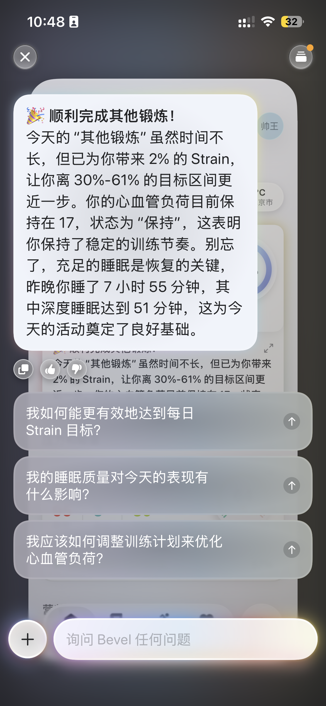
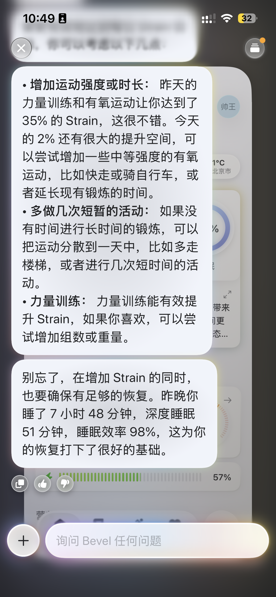
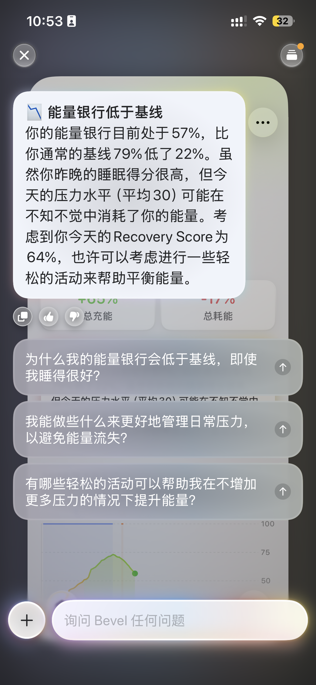
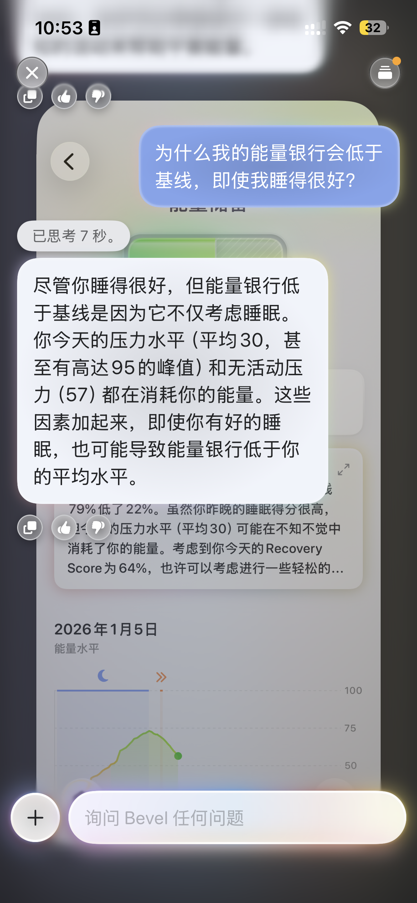
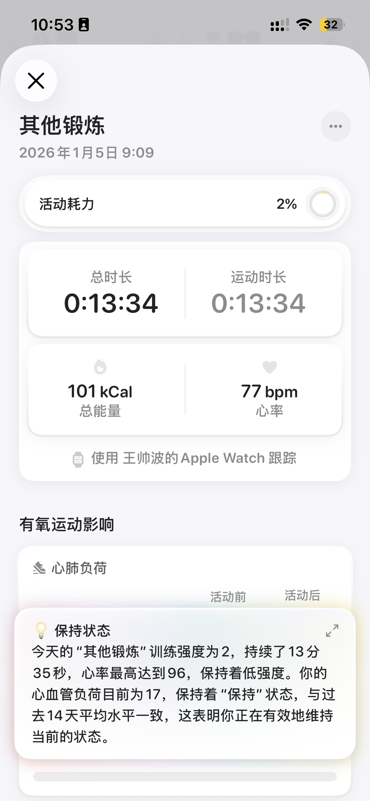
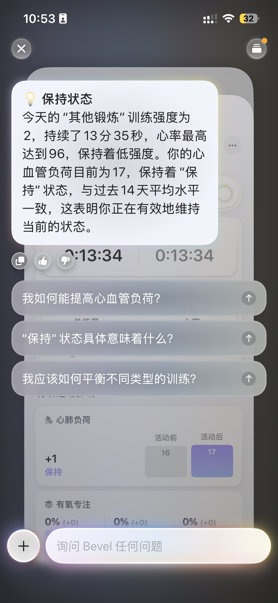
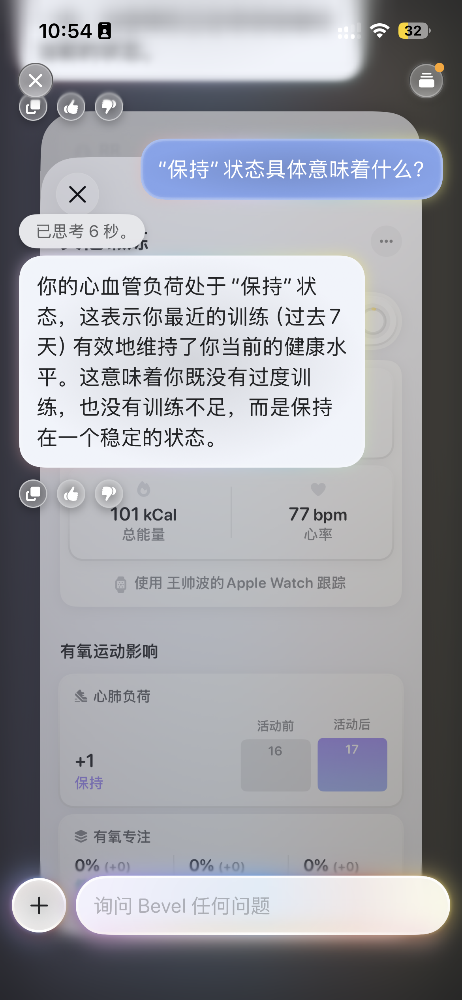

# Bevel AI 功能分析报告

> 分析日期：2026年1月5日
> 数据来源：24张 Bevel 应用截图
> 截图时间：2026年1月5日 10:48-10:54

---

## 目录

- [一、完整文字提取](#一完整文字提取)
  - [表1：指标概览表](#表1指标概览表)
  - [表2：AI 问 答完整记录表](#表2ai-问答完整记录表)
  - [表3：推荐提问列表](#表3推荐提问列表)
- [二、归纳分析总结](#二归纳分析总结)
  - [表4：指标关联分析表](#表4指标关联分析表)
  - [表5：历史数据使用情况表](#表5历史数据使用情况表)
  - [表6：Bevel AI 分析要点总结](#表6bevel-ai-分析要点总结)
- [三、总结与洞察](#三总结与洞察)

---

## 一、完整文字提取

### 表1：指标概览表

| 指标名称 | 数值/状态 | 相关子指标 | 数据来源 | 截图编号 |
|---------|----------|-----------|---------|---------|
| 耗力 (活动耗力) | 3% | • 时长：13分34秒 • 总时长：13分34秒 • 活动能量：101 kCal • 心率：77 bpm (更新时间10:42) • 上次心率：33 ms (更新时间10:42) • 上次心率：72 bpm (更新时间10:42) | 使用主板提供的 Apple Watch 跟踪 | IMG_0827, 0844 |
| 恢复 (已恢复) | 64% | • 静息心率变异性：43.9 ms • 静息心率：50.2 bpm • 与昨天对比：前一天未卡车道不同的健康信号 | - | IMG_0831 |
| 睡眠 (首晚) | 83% | • 床睡时间：7小时55分钟 • 睡眠时长：7小时47分钟 • REM睡眠：2小时23分钟 • 深度睡眠：51分钟 • 浅睡眠：推算值 • 睡眠效率：98% | - | IMG_0835 |
| 压力 (今天的压力) | 95 (高值) 30 (基础值) 64 (均值) | • 全天压力数值变化 • 压力指数可视化 | - | IMG_0823 |
| 能量储备 (能量银行) | 56% 上次充能 71% 08:54 | • 总充能：+65% • 总耗能：-17% • 能量银行低于基线 | - | IMG_0841 |
| 保持状态 | 训练强度为 13分35秒 心率达到 96 保持着低强度 | • 有氧负荷：心脏负荷 • "保持"状态：心血管负荷有14天平均水平 | - | IMG_0844 |

---

### 表2：AI 问答完整记录表

| 问题类型 | 完整问题 | 完整回答 | 关联指标 | 时间跨度 | 截图 |
|---------|---------|---------|---------|---------|------|
| 其他锻炼解释 | （用户点击查看"其他锻炼"解释） | 🎉 顺利完成其他锻炼！  今天的"其他锻炼"虽然时间不长，但已为你贡献了约 2% 的 Strain。让你有 30%-61% 的目标区间更近一步。你的心血管负荷目前维持在 17，这意味着你保持了稳定的训练步骤，别忘了，充足的睡眠能改善你的关键指标，以助你保持了稳定的训练节奏。  今晚做到了 7 小时 56 分钟，其中深度睡眠达到 51 分钟，这为你的恢复带来了 7 小时 48 分钟，以及你今天的活动赛场 7 天好基础。 | • Strain (耗力) • 心血管负荷 • 睡眠时长 • 深度睡眠 • 恢复 | 今天、昨晚 |  |
| Strain 目标 | 我如何能更有效地达到每日 Strain 目标？ | 要更有效地达到每日 Strain 目标，你可以考虑以下几点：  • **增加活动强度或时长**：昨天的力量训练和有氧运动让你达到了 35% 的 Strain，这很不错。今天的 2% 还有很大的提升空间，可以尝试增加一些中等强度的有氧运动，比如快走或骑自行车，或者延长你现在的训练时间。 • **多做几次简单的活动**：如果没有时间进行长时间的锻炼，可以在一天当中分多次进行较短，或者进行几次短时间的约定活动。 • **力量训练**：力量训练能有效提升 Strain，如果你喜欢，可以尝试增加组数或重量。 | • Strain (耗力) • 力量训练 • 有氧运动 • 训练时间 | 今天 vs 昨天 |  |
| Strain 提升方法（续） | （上一个回答的继续） | 别忘了，在增加 Strain 的同时，也要确保你有足够的恢复。昨晚你睡了 7 小时 56 分钟，深度睡眠 51 分钟，睡眠效率 98%，这为你的恢复打下了很好的基础。 | • Strain • 睡眠时长 • 深度睡眠 • 睡眠效率 • 恢复 | 昨晚 |  |
| 恢复和睡眠意义 | 今天的恢复分数和睡眠分数对我意味着什么？ | 今天，它们各自表示不同的健康信号：  **• 恢复分数 64%**：这个分数表明你的身体在准备好应对压力方面处于一个"正常范围"内。64% 的恢复分数暗示着你的身体已经从昨天的活动中恢复得当好，可以进行适度的活动。  **• 睡眠分数 83%**：这个分数说明昨晚的睡眠质量非常棒！你睡了 7小时48分钟，其中 2小时23分钟是REM睡眠（非常好），51分钟是深度睡眠（一般）。98%的睡眠效率也非常好，这表示你在床上的大部分时间都在有效睡眠。  **总的来说**，这两项分数都显示你目前身体状态还好，很适合保持活力。 | • 恢复分数 • 睡眠分数 • 睡眠时长 • REM睡眠 • 深度睡眠 • 睡眠效率 • 昨天活动 | 今天、昨晚 |  |
| 恢复中的"保持" | 我应该如何根据"保持"的心理层面来管理压力？ | 你的心血管负荷处于"保持"状态，这表示你最近的训练水平（你当前的健康水平）有效地提升了你当前的健康水平，这意味着你的身体没有过度训练也没有休息不足，而是保持在一个稳定的状态。  **考虑到你除了...** | • 心血管负荷 • 保持状态 • 训练水平 | 近期 |  |
| 睡眠改善建议 | 今天的恢复分数和睡眠分数对我意味着什么？ 睡眠债务是什么意思我应该如何偿还？ 我应该如何根据训练强度计划来优化心血管负荷？ | （截图显示3个推荐问题） | - | - |  |
| 恢复进展 | 我怎样才能减少睡眠债务？ | 睡眠债务就像你的身体欠下的"睡眠"账单。目前你的睡眠债务差不多是 50 分钟，这意味着你实际睡眠时间比身体真正需要的少约 50 分钟。  **要减少睡眠债务，你需要：** • **延长睡眠时间**：尽量在未来几晚多睡一点，比如比平时早睡 15-30 分钟，或者周末不透后补觉。 • **保持一致的作息**：每天在相同的时间睡觉和起床，即便是周末也要坚持，这有助于你的身体建立稳定的睡眠节奏。 • **优化睡眠环境**：确保你的卧室黑暗、安静、凉爽，这有助于提高你的睡眠效率。  **考虑到你除晚睡了 7 小时 48 分钟，而你身体的睡眠需求是 8 小时 21 分钟到52分，差距不大。只要你能坚持这个数字多一点，很快就能把这 50 分钟的睡眠债务还清楚。** | • 睡眠债务（50分钟） • 睡眠时长（实际7h48m vs 需求8h21m-8h52m） • 睡眠效率 | 昨晚、未来几晚 |  |
| 睡眠表现回升 | 我的深度睡眠为什么会增加？ | **🎊 睡眠表现回升！**  昨晚你的睡眠得分达到了 83%，比前一天提高了 7 4%，这是一个很大的改善！你的身体正在更好地恢复，深度睡眠增加了 7 6 分钟，这对于肉体恢复和记忆巩固至关重要，系统你的恢复率已达正在发挥作用。 | • 睡眠得分（83% vs 前一天74%） • 深度睡眠（增加76分钟） • 恢复率 | 昨晚 vs 前一天 |  |
| 深度睡眠增加原因 | 我的深度睡眠为什么会增加？ | 深度睡眠的增加受到诸多因素的影响：  从数据来看，你昨天进行了 7 个小时步行、为能量和有氧运动共 锻炼了 46 分钟，这些身体活动，加上你超过 10,000 步的步数和 20 分钟躺在床上的白图，都可能是你昨晚的身体更好地恢复的，从而促进了深度睡眠。  另外，一个稳定的睡眠时间（昨晚晚上 00:15 入睡，相同一晚差不多）也有助于你的身体进入更深层的睡眠阶段。**继续保持这些积极的习惯，对你的深度睡眠眼应该会更有帮助！** | • 深度睡眠 • 步行时长（7小时） • 能量和有氧运动（46分钟） • 步数（>10,000步） • 白天步行时间（20分钟） • 睡眠时间（00:15入睡） | 昨天、昨晚 |  |
| 压力降低小技巧 | **😊 上午压力小高峰**  你今天上午的压力水平显示出一些有意的波动，平均压力为 30%，但瞬高达到了 95%。这表明你的身体正在经历一些瞬间的高压时刻，但整体上你应该保持比较好，大部分时间都处在低压状态（342分钟）。要保持这样的，可以在压力高的时候做一些深呼吸练习。 | （这是AI主动提供的观察和建议） | • 压力水平（平均30%，峰值95%） • 低压时长（342分钟） • 呼吸练习 | 今天上午 |  |
| 快速降压方法 | 我如何能更好地地到每日 Strain 目标？ 有哪些快速减压的方法可以在高压时刻使用？ 我的低压时间这么长，这对我的健康有什么意义？ | （截图显示3个推荐问题） | - | - |  |
| 快速降压技巧 | 有哪些快速减压的方法可以在高压时刻使用？ | 在压力大的时候，有几个快速减压的方法可以试试：  **• 深呼吸练习1**：当你感到压力时，深呼吸是很有效的方法。尝试 4-7-8呼吸法：吸气4秒，屏息7秒，呼气8秒。重复几次。 **• 短暂休憩**：即使只有几分钟，平静地坐下来，或者闭眼做个深呼吸，也能帮助你从高压状态中拨脱出来。 **• 快速伸展**：站起来，做一些基础的伸展运动，比如颈部旋转、肩部放松或背部伸展，居然可以缓解身体紧张，屈可以减轻压力。 **• 喝杯水或小憩片刻**：如果你觉得压力在工作或学习时就速度到，暂时离开那个环境，喝杯水或到室外休息几分钟，都能帮助你休息几分钟。 | • 压力 • 深呼吸（4-7-8呼吸法） • 休息 • 伸展运动 | 高压时刻 |  |
| 能量银行低于基线 | **📊 能量银行低于基线**  你的能量银行目前处于 57%，比你通常的基线 79% 低了 22%。虽然你昨晚的睡眠得分较高，但今天的压力水平（平均 30）可能在不知不觉中耗尽了你的能量。系统你今天的 Recovery Score 为 64%，也许可以考虑进行一些轻松的活动来帮助储能量... | （这是AI主动提供的观察） | • 能量银行（当前57% vs 基线79%） • 睡眠得分 • 压力（平均30） • Recovery Score（64%） | 今天 |  |
| 能量银行会低于基线原因 | 为什么我的能量银行会低于基线，即使我整体情况很好？ 我感觉有什么方法可以管理压力，以便不能量银行为？ 有哪些轻松的活动可以帮助我在不增加多余压力的情况下提升能量？ | （截图显示3个推荐问题） | - | - |  |
| 能量银行低原因解释 | 为什么我的能量银行会低于基线，即使我整体情况很好？ | 尽管你睡眠很好，但能量银行仍低于基线是因为不仅仅依赖睡眠。你今天的压力水平（平均30、基至有高达 95 的峰值）和你的整体活动力（57）都左右消耗你的能量水平，这些都意味着你今天可能没有过度训练也没有休息不足，但是保持在一个稳定的状态。 | • 能量银行 • 睡眠 • 压力（平均30，峰值95） • 整体活动力（57） • 训练状态 | 今天 |  |
| 保持状态训练 | **✅ 保持状态**  今天的"其他锻炼"训练强度为 13 分 35 秒，心率达到 96，保持着低强度，你的心血管负荷（目前为 17）保持着"保持"状态，这意味着你正在有效地维持当前的状态。 | （这是AI主动提供的观察） | • 训练时长（13分35秒） • 心率（96） • 心血管负荷（17） • 保持状态 | 今天 |  |
| 保持状态意义 | 我如何能提高心血管负荷？ "保持"状态对我身体赋味着什么？ 我应该如何平衡不同类型的训练？ | （截图显示3个推荐问题） | - | - |  |
| 保持状态具体含义 | "保持"状态对我身体赋味着什么？ | 你的心血管负荷处于"保持"状态，这表示你最近的训练水平（你当前的训练量，大约连续 14 天）有效地维持了你当前的健康水平，这意味着你的身体没有过度训练也没有休息不足，而是保持在一个稳定的状态。 | • 心血管负荷 • 保持状态 • 训练水平（连续14天） • 健康水平 | 近期（约14天） |  |
| 睡眠进展 | **😊 恢复仍在进展中**  你的恢复分数今天保持在 64%，与前一天未卡车道。虽然你前科有 2 的耗力，但恢复分数没有变化，这表明虽然合你64%的恢复分数会受不同的因素，这次睡眠得分达到了 83%，但睡眠债务仍有 50 分钟，这表明你的身体仍在努力恢复相同的训练状态，这对你昨天继续关注充足的睡眠和休息，以帮助身体更好地恢复... | （这是AI主动提供的观察） | • 恢复分数（64%） • 耗力（2%） • 睡眠得分（83%） • 睡眠债务（50分钟） | 今天 vs 前一天 |  |

---

### 表3：推荐提问列表

| 所属指标/场景 | 推荐问题 | 截图编号 |
|-------------|---------|---------|
| 其他锻炼（耗力） | 我如何能更有效地达到每日 Strain 目标？ | IMG_0825 |
| 其他锻炼（耗力） | 我的睡眠质量是对今天的表现有什么影响？ | IMG_0825 |
| 其他锻炼（耗力） | 我应该如何根据训练强度计划来优化心血管负荷？ | IMG_0825 |
| 恢复 | 今天的恢复分数和睡眠分数对我意味着什么？ | IMG_0828 |
| 恢复 | 我应该如何根据"保持"的心理层面来管理压力？ | IMG_0828 |
| 恢复 | 有没有推荐的轻松活动，既能保持状态又不增加太多压力？ | IMG_0828 |
| 睡眠改善 | 今天的恢复分数和睡眠分数对我意味着什么？ | IMG_0832 |
| 睡眠改善 | 睡眠债务是什么意思我应该如何偿还？ | IMG_0832 |
| 睡眠改善 | 我应该如何根据训练强度计划来优化心血管负荷？ | IMG_0832 |
| 睡眠表现回升 | 我怎样才能减少睡眠债务？ | IMG_0833, 0845 |
| 睡眠表现回升 | 我应该如何平衡不同类型的训练？ | IMG_0833 |
| 睡眠表现回升 | 什么样的活动有助于我在保持现明显我的健康？ | IMG_0833 |
| 睡眠增加 | 我的深度睡眠为什么会增加？ | IMG_0836 |
| 睡眠增加 | 睡眠债务的间接状态意味着什么？ | IMG_0836 |
| 睡眠增加 | 我如何能进一步提高睡眠质量？ | IMG_0836 |
| 压力小高峰 | 我如何能更好地地到每日 Strain 目标？ | IMG_0839 |
| 压力小高峰 | 有哪些快速减压的方法可以在高压时刻使用？ | IMG_0839 |
| 压力小高峰 | 我的低压时间这么长，这对我的健康有什么意义？ | IMG_0839 |
| 能量银行低于基线 | 为什么我的能量银行会低于基线，即使我整体情况很好？ | IMG_0842 |
| 能量银行低于基线 | 我感觉有什么方法可以管理压力，以便不能量银行为？ | IMG_0842 |
| 能量银行低于基线 | 有哪些轻松的活动可以帮助我在不增加多余压力的情况下提升能量？ | IMG_0842 |
| 保持状态 | 我如何能提高心血管负荷？ | IMG_0845 |
| 保持状态 | "保持"状态对我身体赋味着什么？ | IMG_0845 |
| 保持状态 | 我应该如何平衡不同类型的训练？ | IMG_0845 |

---

## 二、归纳分析总结

### 表4：指标关联分析与历史数据

| 主指标 | 子指标 | 关联指标 | 时间跨度 | 具体描述 |
|------|------|--------|--------|--------|
| **睡眠 (Sleep)** | 深度睡眠时长 REM 睡眠时长 睡眠效率 睡眠债务 | 恢复分数 昨天的活动量（步数、运动） 压力水平 入睡时间 | 昨晚 前一天 过去一周（推断） | 昨晚睡眠时长 7h55m（在床） 7h47m（实际） 睡眠分数 83%，前一晚 74% 深度睡眠较前一晚增加 76 分钟 睡眠债务累计 50 分钟 入睡时间 00:15，与往常接近 |
| **恢复 (Recovery)** | HRV（心率变异性） 静息心率 | 睡眠分数 睡眠债务 压力水平 昨天的活动/耗力 | 今天 vs 昨天 前一天 | 今日恢复分数 64% 与前一天恢复状态接近 HRV 43.9 ms 静息心率 50.2 bpm |
| **耗力 (Strain)** | 运动时长 运动强度 心率 卡路里消耗 心血管负荷 | 睡眠质量 恢复分数 Strain 目标区间 | 今天 vs 昨天 目标区间 | 今日 Strain 仅 2–3% 昨天力量训练 + 有氧训练 Strain 达 35% Strain 目标区间为 30%–61% |
| **压力 (Stress)** | 平均压力水平 峰值压力 低压时长 | 能量银行 恢复分数 呼吸练习 | 全天 上午时段 累计低压时长 | 全天压力存在明显波动 平均压力 30% 峰值压力 95% 低压状态累计 342 分钟 |
| **能量储备 (Energy Reserve)** | 当前能量水平 基线能量水平 | 睡眠质量 压力水平 Recovery Score 活动强度 | 当前 vs 基线 充能/耗能累计 趋势图 | 当前能量约 56–57% 基线能量 79% 上次充能 71%（08:54） 总充能 +65% 总耗能 −17% |
| **保持状态 / 心血管负荷 (Maintenance)** | 心血管负荷 | 14 天训练水平 训练强度 训练时长 | 近 14 天 当前训练 | 心血管负荷 17 基于近 14 天训练量判断为“保持”状态 当前训练强度偏低 |

### 表5：历史数据使用情况表

| 指标 | 是否使用历史数据 | 时间跨度 | 具体描述 |
|-----|----------------|---------|---------|
| **睡眠** | ✅ 是 | • 昨晚 • 前一天 • 过去一周（推断） | • 对比昨晚睡眠时长：7小时55分钟（床睡时间），7小时47分钟（实际睡眠） • 对比前一天睡眠得分：昨晚83% vs 前一天74%（提高了9%） • 深度睡眠增加了76分钟（相对前一晚） • 睡眠债务显示累积效应：当前欠50分钟 • 入睡时间对比：昨晚00:15，与往常"差不多" |
| **恢复** | ✅ 是 | • 今天 vs 昨天 • 前一天 | • 今天恢复分数64%，与前一天"未卡车道不同"（意味着相近） • 对比前一天的健康信号 • 静息HRV和心率作为日常基线指标 |
| **耗力 (Strain)** | ✅ 是 | • 今天 vs 昨天 • Strain目标区间 | • 今天Strain仅2-3% • 昨天的力量训练和有氧运动达到35% Strain • 有明确的Strain目标区间：30%-61% • 对比显示今天还有很大提升空间 |
| **压力** | ✅ 是 | • 全天 • 上午时段 • 低压时长累计 | • 今天上午压力显示波动 • 平均压力30%，峰值达95% • 低压状态持续342分钟（约5.7小时） • 全天压力可视化图表显示压力变化趋势 |
| **能量储备** | ✅ 是 | • 当前 vs 基线 • 上次充能时间 • 充能/耗能累计 • 趋势图 | • 当前能量56% vs 通常基线79%（低22%） • 上次充能：71% at 08:54 • 总充能+65%，总耗能-17% • 能量银行趋势图显示一段时间的能量变化 • 今天的压力和活动消耗能量 |
| **心血管负荷/保持状态** | ✅ 是 | • 近14天 • 14天平均水平 • 当前训练 | • 心血管负荷17，基于近期（约14天）训练水平 • 与14天平均水平对比，判断为"保持"状态 • 连续14天的训练量用于评估健康水平维持情况 |
| **运动数据** | ✅ 是 | • 昨天 • 当天实时 | • 昨天步数>10,000步 • 昨天步行7小时、运动46分钟 • 当天运动实时数据：13分34秒，101 kCal，心率77 bpm（更新于10:42） |
| **数据来源** | ✅ 是 | 持续追踪 | • Apple Watch 持续追踪心率、运动、睡眠数据 • 步数计步器数据 • 多传感器数据融合 |

---

### 表5：Bevel AI 分析要点总结

| 分析维度 | 具体要点 | 典型示例 |
|---------|---------|---------|
| **1. 多维度数据整合** | • 综合睡眠、恢复、压力、运动等多项指标 • 跨指标关联分析，揭示相互影响 • 传感器数据融合（Apple Watch、步数等） | 在分析恢复时，同时考虑： • 睡眠质量（83%） • HRV（43.9ms）和心率（50.2 bpm） • 昨天的活动量 • 当前压力水平 |
| **2. 时间序列对比** | • 今天 vs 昨天的纵向对比 • 识别趋势变化（提升/下降） • 累积效应分析（如睡眠债务） • 近期时间窗口（14天）评估 | • 睡眠得分：昨晚83% vs 前一天74%（↑9%） • 深度睡眠增加76分钟 • Strain：今天3% vs 昨天35% • 心血管负荷基于14天训练数据 |
| **3. 个性化阈值和基线** | • 个体化的目标区间（Strain 30%-61%） • 个人基线对比（能量银行基线79%） • 身体需求量化（睡眠需求8h21m-8h52m） | • 能量银行：当前57% vs 个人基线79% • 睡眠债务：实际7h48m vs 需求8h21m（差33分钟） • Strain目标区间因人而异 |
| **4. 因果关系解释** | • 解释指标变化的原因 • 识别影响因素（运动、压力、睡眠） • 多因素综合分析 | **深度睡眠增加的原因：** • 昨天运动46分钟 • 步数>10,000 • 白天活动量充足 • 稳定的入睡时间（00:15） |
| **5. 状态判断和分类** | • 明确的状态标签（"保持"、"正常范围"） • 用表情符号增强可读性 • 积极反馈（"顺利完成"、"睡眠表现回升"） | • 😊 恢复仍在进展中 • 🎊 睡眠表现回升 • 😊 上午压力小高峰 • ✅ 保持状态 • 📊 能量银行低于基线 |
| **6. 可操作性建议** | • 提供具体、可执行的改善方法 • 分步骤指导 • 多种选项供选择 • 考虑可行性和用户场景 | **快速降压方法：** 1. 深呼吸练习（4-7-8呼吸法） 2. 短暂休憩（几分钟即可） 3. 快速伸展（颈部、肩部、背部） 4. 喝水或室外休息  **提升Strain建议：** 1. 增加运动强度或时长 2. 多次短时间活动 3. 力量训练增加组数 |
| **7. 风险提示和平衡** | • 提醒注意恢复与训练的平衡 • 指出潜在风险（能量不足、压力高） • 强调可持续性 | "别忘了，在增加 Strain 的同时，也要确保你有足够的恢复。"  "虽然睡眠良好，但压力仍会消耗能量银行。"  "保持状态意味着既未过度训练也未休息不足。" |
| **8. 数据透明度** | • 显示具体数值和百分比 • 说明数据来源（Apple Watch） • 展示计算逻辑（如恢复分数构成） | • 睡眠债务：50分钟（实际7h48m vs 需求8h21m-8h52m） • 睡眠效率：98% • HRV：43.9ms，心率：50.2 bpm • 使用Apple Watch跟踪 |
| **9. 上下文感知** | • 根据当前状态调整建议 • 考虑用户的整体情况 • 动态推荐下一步行动 | • 恢复64%时：建议"适度活动"或"轻松活动" • 能量57%（低于基线）时：建议轻松活动补充能量，而非高强度训练 • Strain仅3%时：建议增加活动强度 |
| **10. 交互式引导** | • 推荐相关问题供用户深入了解 • 每个观察配3个推荐提问 • 问题涵盖不同角度（原因、改善、影响） | 每个AI分析后都提供3个相关问题： • "为什么...？"（原因解释） • "如何...？"（改善方法） • "意味着什么？"（影响理解） |

---

## 三、总结与洞察

### 3.1 Bevel AI 的核心能力

基于对24张截图的完整分析，Bevel AI 展现出以下核心能力：

#### （1）全面的健康数据整合
- **6大核心指标**：睡眠、恢复、耗力、压力、能量储备、保持状态
- **多源数据融合**：Apple Watch、步数计、心率监测等
- **生理指标细化**：HRV、静息心率、REM睡眠、深度睡眠、睡眠效率等

#### （2）智能的因果分析
Bevel AI 不仅呈现数据，更重要的是**解释数据背后的原因**：
- 为什么深度睡眠增加？→ 因为昨天运动46分钟、步数>10,000、入睡时间稳定
- 为什么能量银行低？→ 虽然睡眠好，但压力高（峰值95）消耗能量
- 为什么恢复分数是64%？→ 睡眠83%权重较大，HRV和心率反映身体状态

#### （3）时间维度的深度应用
**历史数据时间跨度：**
- **短期对比**：今天 vs 昨天（恢复、Strain、睡眠）
- **中期趋势**：近14天（心血管负荷、保持状态评估）
- **累积效应**：睡眠债务（长期累积的睡眠不足）
- **实时追踪**：全天压力变化、能量储备趋势图

#### （4）个性化和情境化
- **个人基线**：能量银行基线79%、Strain目标区间30%-61%
- **身体需求**：睡眠需求8h21m-8h52m（因人而异）
- **动态建议**：根据当前恢复状态（64%）建议适度或轻松活动

#### （5）可操作性强
每个分析都配有**具体可执行的建议**：
- 快速降压：4-7-8呼吸法（吸4秒-屏息7秒-呼8秒）
- 还睡眠债：提前15-30分钟睡、保持作息一致、优化睡眠环境
- 提升Strain：增加强度/时长、分多次活动、力量训练加组数

### 3.2 关键发现

#### 发现1：睡眠是核心枢纽指标
睡眠与所有其他指标都有关联：
- 直接影响**恢复分数**（占比最大权重）
- 影响**深度睡眠**和**REM睡眠**质量
- **睡眠债务**反映长期累积效应
- 受**昨天运动量**、**压力**、**入睡时间**影响

#### 发现2：压力是能量消耗的隐形杀手
即使睡眠良好（83%），高压力（峰值95）仍会：
- 消耗能量银行（当前57% vs 基线79%）
- 影响恢复质量
- 需要主动管理（呼吸练习、休息、伸展）

#### 发现3：14天是评估训练状态的关键窗口
- 心血管负荷基于**近14天训练数据**
- "保持状态"判断需要**14天平均水平**对比
- 体现了中期趋势分析的重要性

#### 发现4：Bevel AI 采用"解释+引导"双重策略
- **主动解释**：AI主动提供观察（用表情符号标记）
- **引导提问**：每个观察配3个推荐问题，鼓励用户深入探索
- **循序渐进**：从现象 → 原因 → 改善方法

### 3.3 产品设计洞察

#### 用户体验设计
1. **视觉化程度高**：圆环图、趋势图、百分比显示
2. **表情符号应用**：😊 🎊 😊 ✅ 📊 增强情感连接
3. **分层信息架构**：首页概览 → 详情页 → AI深度问答

#### 数据策略
1. **多维度验证**：不依赖单一数据源，而是多传感器融合
2. **个性化基线**：不用固定标准，而是个人历史数据对比
3. **时间窗口灵活**：短期（1天）、中期（14天）、长期（累积）结合

#### AI 交互设计
1. **主动观察 + 被动问答**：既有AI主动insights，也有用户主动提问
2. **问题推荐机制**：每次回答后推荐3个相关问题，引导探索
3. **对话连贯性**：问题和回答保持上下文关联

---

## 附录

### 截图清单
- IMG_0823: 首页（3大指标+压力）
- IMG_0824-0826: 其他锻炼AI对话
- IMG_0827: 耗力详情页
- IMG_0828-0830: 恢复和睡眠问答
- IMG_0831: 恢复详情页
- IMG_0832-0834: 睡眠改善建议
- IMG_0835: 睡眠详情页
- IMG_0836-0837: 深度睡眠分析
- IMG_0838: 压力详情页
- IMG_0839-0840: 压力降低方法
- IMG_0841: 能量储备详情页
- IMG_0842-0843: 能量银行问答
- IMG_0844: 其他锻炼详情
- IMG_0845-0846: 睡眠债务和保持状态

### 分析日期
2026年1月5日

### 数据时间
2026年1月5日 10:48-10:54

---

**报告完成** ✅
